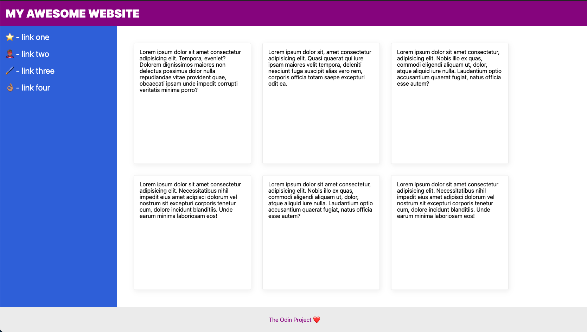
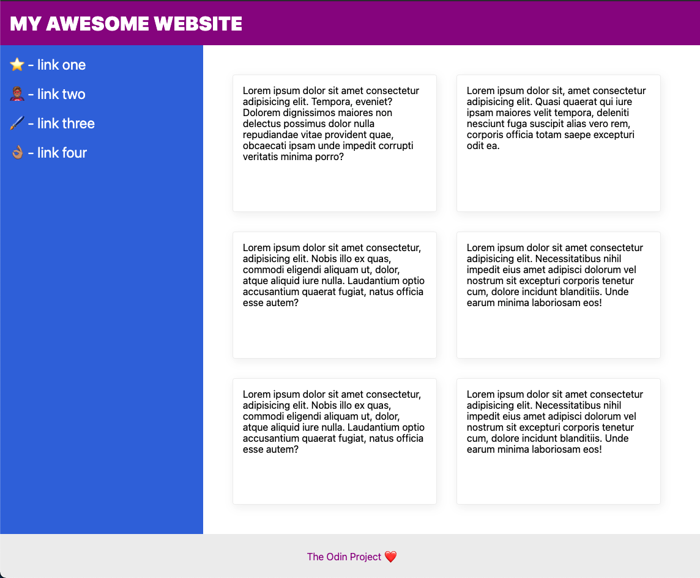

# The Holy Grail of Layout

An incredibly common website layout. It is so common that it is often called the [Holy Grail](https://www.google.com/search?q=holy+grail+layout&tbm=isch&sclient=img)

## Outcome:

The number of cards lined up in that section will change based on the width of your screen, so don't stress about getting _exactly_ a 2x3 or 3x2 grid.

On a smaller screen it will look like this:

<a href="https://github.com/TheOdinProject/css-exercises">css exercises</a>
